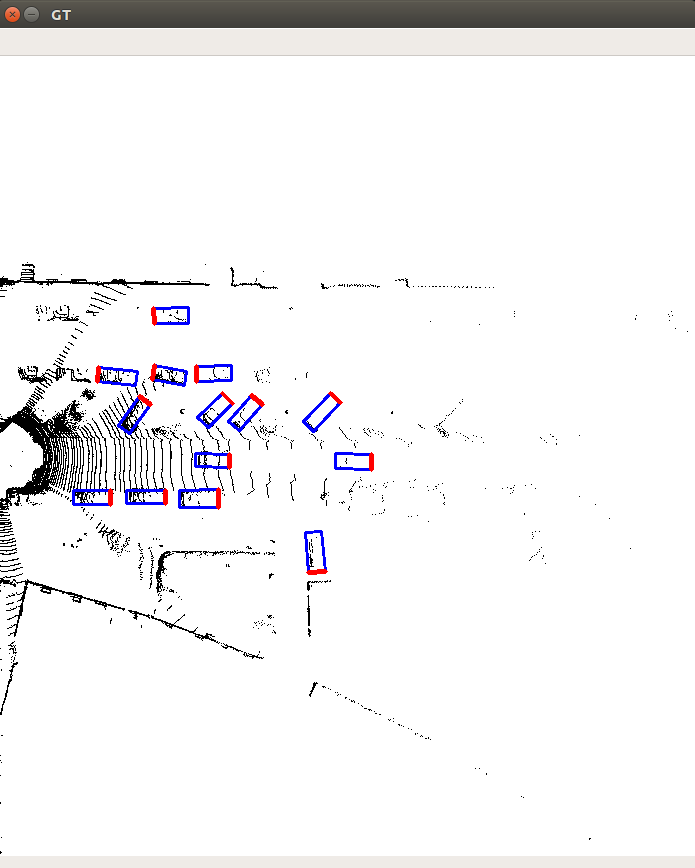
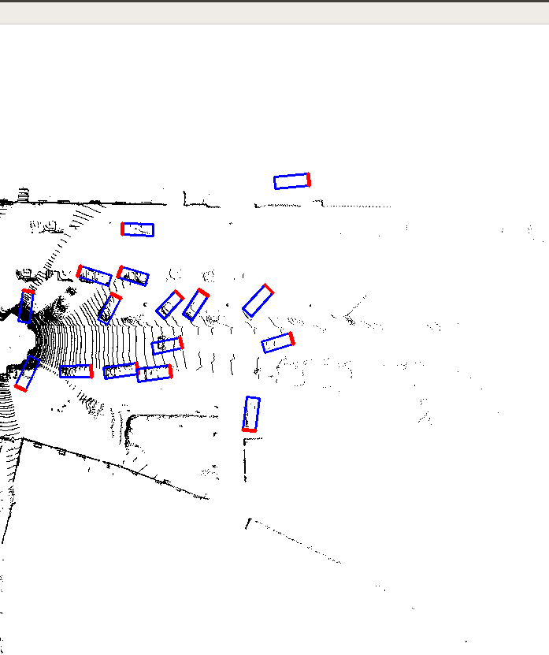

# Introduction

This is an unofficial inplementation of [Bird's Eye View Object Detection Algorithm for self-driving Cars] [PIXOR](http://openaccess.thecvf.com/content_cvpr_2018/CameraReady/3012.pdf) in Pytorch. A large part of this project is based on the work [here](https://github.com/ankita-kalra/PIXOR). Thanks to [@Ankita Kalra](https://github.com/ankita-kalra). This work is still ongoing.Origin project is based on the work [here](https://github.com/philip-huang/PIXOR).Thanks to [@philip-huang](https://github.com/philip-huang).

# Handling colored points clouds
https://github.com/overfitover/pixor_ovo
# Dependencies
- `python3.5+`
- `Pytorch` (tested on 0.4.1)
- `opencv-python`
- `shapely`
- `matplotlib`
- `tensorboardX`

# Installation
1. Clone this repository.


# Data Preparation
1. Download the 3D KITTI detection dataset from [here](http://www.cvlibs.net/datasets/kitti/eval_object.php?obj_benchmark=3d). Data to download include:
    * Velodyne point clouds (29 GB): input data to VoxelNet
    * Training labels of object data set (5 MB): input label to VoxelNet
    * Camera calibration matrices of object data set (16 MB): for visualization of predictions
    * Left color images of object data set (12 GB): for visualization of predictions

2. Split the training set into training and validation set according to the protocol [here](https://xiaozhichen.github.io/files/mv3d/imagesets.tar.gz). And rearrange the folders to have the following structure:
```plain
└── KITTI
       ├── training   <-- training data
       |   ├── image_2
       |   ├── label_2
       |   └── velodyne
       └── validation  <--- evaluation data
       |   ├── image_2
       |   ├── label_2
       |   └── velodyne
       |
       |__ train.txt
       |
       |__ val.txt
       |
       |__ trainval.txt
```

# Train

```bash
$ python run_training.py
```
1. There is a pre-trained model for car in `pretrained_models/model_90.pth`.


# inference
```bash
$ python run_inference.py
```
**by the way**　在model里面有７层se_module,你可以尝试不同的组合是否可以提升网络的效果。

# results
## GT

## prediction

## prediction (add se_module)


# TODO
- [X] datagen.py maybe has a problem. h w l x y z   w h l y z x.
- [X] improve the performances
- [ ] reproduce results for `Pedestrian` and `Cyclist`
- [X] provide SummaryWriter()
- [ ] provide run_evaluate.py
